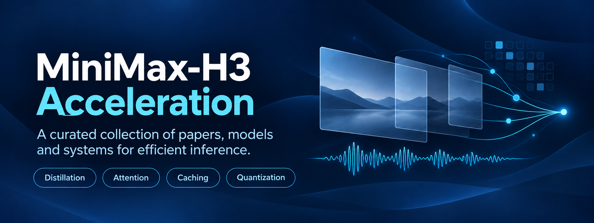

  

<h1 align="center">Awesome MiniMax-H3 Acceleration</h1>

  <strong>A curated index of MiniMax-H3 acceleration methods, implementations, and related resources.</strong> 
  Methods, papers, checkpoints, and systems for researchers and inference engineers.

  
  
  
  

  <a href="#scope">Scope</a> ·
  <a href="#overview">Overview</a> ·
  <a href="#methods">Methods</a> ·
  <a href="#benchmarks">Benchmarks</a> ·
  <a href="#related">Related Resources</a> ·
  <a href="#contributing">Contributing</a>

---

> [!NOTE]
> This is an independent index of publicly available papers, models, implementations, and evaluations. Inclusion requires an explicit MiniMax-H3 connection in a paper, model card, implementation, or experiment. Entries describe public releases; inclusion does not imply independent reproduction or production readiness.

## &nbsp; Scope & Baseline

This collection covers inference acceleration for **MiniMax-H3**, including optimization of the original model, few-step adapters, compressed or architecturally modified variants, and serving systems. It prioritizes the mechanism, release provenance, and validated task scope of each work.

**Baseline resources:** [official repository](https://github.com/MiniMax-AI/MiniMax-H3) · [original checkpoints](https://huggingface.co/MiniMaxAI/MiniMax-H3) · [ComfyUI checkpoint distribution](https://huggingface.co/Comfy-Org/MiniMax-H3).

H3 processes multimodal inputs in a shared token sequence and jointly denoises video and audio. Its released base checkpoints already incorporate CFG distillation. The original Omni-Transformer includes AdaLN branches whose modulation outputs can be precomputed for inference. The methods below target attention computation, denoiser evaluations, modulation computation, and inference scheduling. See the [official architecture description](https://github.com/MiniMax-AI/MiniMax-H3#model-architecture).

**Curation boundary.** General diffusion methods appear here only when H3-specific evidence is available. Format conversions and UI integrations are attributed to their upstream method. Generic deployment interfaces, aesthetic LoRAs, and unrelated video models are outside the main taxonomy.

#### Terminology

| Term | Meaning in this index |
| :--- | :--- |
| **T2VA** | Text-to-video generation with audio. |
| **I2VA** | Image-to-video generation with audio. |
| **FL2VA** | First-/last-frame-conditioned audio-video generation; the base FL2VA checkpoint also supports text-only input. |
| **Ref2VA** | Generation conditioned on multimodal references. |
| **NFE** | Number of denoiser function evaluations; distinguish this from scheduler grid points and per-chunk step counts. |
| **H3-derived model** | A model trained from or built on H3 with altered weights, architecture, or generation protocol. |

#### Training-Mode Labels

Each entry carries one or more of the following badges. They describe a method's provenance and dependencies, not whether the end user needs to train a released implementation locally.

| Label | Meaning |
| :--- | :--- |
|  | Adds or relies on method-specific trained weights, LoRA, distillation, a learned predictor, or another learned component. |
|  | Changes the inference path without updating model parameters. |
|  | Uses offline quantization, compilation, pruning, format conversion, or precomputation; no user-side model training is required. |
|   | Hybrid: combines a method-specific trained component with a separate training-free or conversion/compression optimization, shown as one badge per component. |

## &nbsp; Research Overview

| Research direction | Optimization target | Representative work |
| :--- | :--- | :--- |
| [3.1 Few-Step Generation & Distillation](#distillation) | Denoiser evaluation count and learned sampling trajectories | LightX2V / MiniMax-H3-Turbo, FastH3, PDD H3 Acc-LoRAs, HyperFlow, DMAD, PDMD, LynnReal-Omni |
| [3.2 Efficient Attention & Architecture Modification](#attention) | Attention computation and model structure | Sol-Attn, SubBlock Sparse Attention, FastH3, Veda, Ref2VA-VSA, VDN-H3, MC-Sparse, VC-Attention |
| [3.3 Caching & Feature Prediction](#caching) | Feature reuse and prediction across denoising steps | Spectrum, FirstBlockCache, Block Cache T8, MiniMaxH3-Cache, Cache-DiT, MotionCache, TE-Speed, AdaTaylorCache |
| [3.4 Quantization & Model Compression](#compression) | Weight/activation precision, modulation parameters, memory traffic | ConvRot, ClipProj, H3-NF4, GGUF, OrbitQuant, SVDQuant, AdaLN precomputation |
| [3.5 Kernels, Runtimes, Memory & Distributed Inference](#systems) | Execution efficiency, communication, peak memory, and component placement/offloading | SGLang, Sol-H3, vLLM-Omni, LightX2V, MiniMax H3 Parallel, LongMedia |
| [3.6 VAE & Decoder Acceleration](#vae) | VAE encoding/decoding cost and reconstruction quality versus speed | Light VAE, H3-TAE, MotionCache Fast VAE Decode, H3VAE_TRT, H3 X2 Stream |
| [3.7 Autoregressive Diffusion Acceleration](#ar-diffusion) | Chunked autoregressive generation and cross-chunk memory reuse for streaming | TaoMate-H3 |
| [3.8 Sampling, Solvers & Resolution Scheduling](#sampling) | Numerical solvers, sampling schedules, and spatial resolution during denoising | RefDelta-Solver, H3 SPEED, H3 Latent Upscaler |

Entries are organized by technical contribution. A project may appear in multiple categories when it contributes more than one acceleration mechanism; ports and quantized exports retain their upstream attribution.

<a href="#top">Back to top ↑</a>

## &nbsp; Methods & Implementations

  <a href="#distillation">3.1 Few-Step</a> ·
  <a href="#attention">3.2 Attention</a> ·
  <a href="#caching">3.3 Caching</a> ·
  <a href="#compression">3.4 Compression</a> ·
  <a href="#systems">3.5 Systems</a> ·
  <a href="#vae">3.6 VAE</a> ·
  <a href="#ar-diffusion">3.7 AR Diffusion</a> ·
  <a href="#sampling">3.8 Sampling</a>

### 3.1 Few-Step Generation & Distillation

Adapters and H3-derived models trained for generation with fewer denoiser evaluations.

| Work | Contribution | Notes | Training mode | Resources |
| :--- | :--- | :--- | :--- | :--- |
| **LightX2V / MiniMax-H3-Turbo** | Few-step Turbo adapters with checkpoint-specific sampling schedules. | FL2VA/T2VA and Ref2VA releases; task coverage, shifts, and resolution differ by checkpoint. |  | [Code](https://github.com/ModelTC/Minimax-H3-Turbo) · [Weights](https://huggingface.co/lightx2v/Minimax-h3-Turbo) |
| **LarryVRH H3 Turbo** | Community few-step LoRA with a dedicated H3 sampler and loader. | T2VA/I2VA workflows; runtime handling for unpruned and AdaLN-pruned base checkpoints. Keep this family separate from LightX2V Turbo. |  | [Code](https://github.com/larryvrh/ComfyUI-MiniMax-H3-Turbo) · [Weights](https://huggingface.co/larryvrh/MiniMax-H3-Turbo-Lora) |
| **FastVideo / FastH3** | Data-free distillation combined with video sparse attention. | Multiple releases; the cited 8-Step V2 checkpoint targets T2VA and requires VSA-H3. FL2VA and Ref2VA were not distilled in that release. |  | [Code](https://github.com/hao-ai-lab/FastVideo) · [Weights (8-Step V2)](https://huggingface.co/FastVideo/FastVideo-FastH3-8-Step-V2) · [Weights (collection)](https://huggingface.co/collections/FastVideo/fastvideo-fasth3) |
| **Alibaba PAI / PDD H3 Acc-LoRAs** | Application of Parallel Decoding Distillation to H3, with a backbone adapter and interval-specific output heads. | Separate FL2VA and Ref2VA checkpoints. Requires PDD-aware loading rather than ordinary LoRA loading alone. |  | [Paper](https://arxiv.org/abs/2607.26004) · [Code](https://github.com/aigc-apps/VideoX-Fun) · [Weights](https://huggingface.co/alibaba-pai/MiniMax-H3-Acc-LoRAs) |
| **Video Rebirth / HyperFlow** | Data-free flow self-distillation released as an eight-step adapter. | Official Diffusers Modular Pipeline; T2VA, FL2VA, and Ref2VA workflows retain joint audio-video generation. |  | [Code](https://github.com/Video-Rebirth/hyperflow) · [Weights](https://huggingface.co/videorebirth/hyperflow) |
| **DMAD** | Distribution matching formulated as adversarial distillation. | Four-step H3 audio-video student; distinguish author-supported inference from downstream conversions. |  | [Paper](https://arxiv.org/abs/2610.02188) · [Code](https://github.com/Yzmblog/DMAD) · [Project](https://yzmblog.github.io/projects/DMAD/) |
| **PDMD** | Projected Distribution Matching Distillation, released as two- and four-NFE H3 LoRAs. | The paper reports MiniMax-H3 4-NFE results; full task coverage and independent reproduction need further review. |  | [Paper](https://arxiv.org/abs/2609.35768) · [Weights (2-NFE)](https://huggingface.co/pdmd2026/pdmd_2NFE_lora) · [Weights (4-NFE)](https://huggingface.co/pdmd2026/pdmd_4NFE_lora) |
| **LynnReal-Omni few-step generation** | Four-step Standard and three-step Flash generation. | H3-derived checkpoints with variant-specific task coverage and sampling schedules. |  | [Paper](https://arxiv.org/abs/2609.15863) · [Code](https://github.com/LynnReal-AI/LynnReal-Omni) |

### 3.2 Efficient Attention & Architecture Modification

These works reduce attention computation or change its structure. Training-free approximations, trained sparse models, and hybrid architectures represent different experimental settings.

| Work | Contribution | Notes | Training mode | Resources |
| :--- | :--- | :--- | :--- | :--- |
| **Sol Engine / Sol-Attn** | Training-free sparse attention integrated into Sol Engine. | H3 deployment reports cover attention, runtime, and pipeline optimizations; end-to-end speedups should not be attributed to attention alone. |  | [Paper](https://arxiv.org/abs/2607.24027) · [Project (data center)](https://nvlabs.github.io/Sana/Sol-Engine/H3-DataCenter/) · [Project (GB200)](https://nvlabs.github.io/Sana/Sol-Engine/H3) · [Code (Triton, deprecated)](https://github.com/kijai/ComfyUI-SolAttn_triton) · [Code (CuTe DSL)](https://github.com/quzopl/ComfyUI-SolAttn-H3) |
| **LightX2V Turbo-SLA** | Joint few-step distillation and Sparse–Linear Attention adaptation. | A dedicated four-step FL2VA adapter with 85% attention sparsity, not merely a generic attention switch applied to any Turbo checkpoint. |  | [Weights](https://huggingface.co/lightx2v/Minimax-h3-Turbo-SLA) · [Code (SLA)](https://github.com/thu-ml/SLA) |
| **FastVideo / FastH3** | Video sparse attention coupled with data-free distillation. | See the [3.1 entry](#distillation) for checkpoint and task coverage. |  | [Code](https://github.com/hao-ai-lab/FastVideo) · [Docs (SGLang)](https://docs.sglang.io/cookbook/diffusion/MiniMax/MiniMax-H3) |
| **SGLang SubBlock Sparse Attention** | Training-free block sparsity for H3's long, non-causal DiT self-attention. | Approximate backend with Ulysses support; sparsity and dense warm-up settings require validation for each task, resolution, and duration. |  | [Docs](https://docs.sglang.io/cookbook/diffusion/MiniMax/MiniMax-H3) · [Benchmark](https://www.lmsys.org/blog/2026-08-27-minimax-h3-h200) |
| **Ref2VA-VSA** | VSA gate transplant for sparse Ref2VA inference. | Community 4-step Ref2VA implementation; reported latency is project-specific and has not been independently reproduced here. |  | [Code](https://github.com/Kablex/ComfyUI-Ref2VA-VSA) |
| **Miowtion / Veda** | Learned block selection for video sparse attention, with predictor training and LoRA quality recovery. | H3 implementation supports T2VA, FL2VA, and Ref2VA paths; the released predictor is a preview trained for selected resolutions and 8-step Turbo workflows. |  | [Code (training)](https://github.com/veda-sparse/Miowtion) · [Code (ComfyUI)](https://github.com/veda-sparse/Veda-on-ComfyUI) · [Weights (T2VA predictor)](https://huggingface.co/Veda-Sparse/Minimax-H3-T2VA-Veda-8NFE-600Step-Preview) |
| **Video DeltaNet / VDN-H3** | Video-native hybrid attention, retaining Softmax for interactions involving text or audio. | Architectural adaptation combined with few-step distillation and a serving stack with additional runtime optimizations. |   | [Paper](https://arxiv.org/abs/2609.20744) · [Code](https://github.com/OpenVDN/vdn-minimax-h3) · [Weights](https://huggingface.co/OpenVDN/vdn-minimax-h3) · [Project](https://openvdn.github.io/) |
| **LynnReal-Omni-Flash architecture** | A smaller, 42-block transformer with spatial token selection. | Structural and token-level computation reduction in the Flash variant. |  | [Paper](https://arxiv.org/abs/2609.15863) · [Code](https://github.com/LynnReal-AI/LynnReal-Omni) |
| **MC-Sparse** | Training-free sparse attention with cached query groups, KV selections, and dense–sparse residuals. | Paper includes MiniMax-H3-Base evaluation; research-only entry with no public implementation listed. |  | [Paper](https://arxiv.org/abs/2610.06801) |
| **VC-Attention** | Value smoothing and fused probability casting for low-bit attention. | H3 is included among the evaluated video models; kernel-level and complete-generation effects should be distinguished. |  | [Paper](https://arxiv.org/abs/2609.15810) |
| **H3-Optimizations** | H3-specific sparse scheduling, token ordering, and memory optimization. | Source implementation with configurable backends; includes an experimental AMD path. |  | [Code](https://github.com/Zironic/H3-Optimizations) |

**Backend implementations.** SageAttention and Comfy Kitchen also appear in H3 execution paths. Track the actual H3 integration and hardware requirements rather than treating every generic attention library as an independent H3 method; see the [SGLang H3 cookbook](https://docs.sglang.io/cookbook/diffusion/MiniMax/MiniMax-H3) and [H3 Colab comparison harness](https://github.com/soren-labs/minimax-h3-colab).

### 3.3 Caching & Feature Prediction

Training-free caching and feature prediction reduce denoiser computation by reusing or approximating intermediate features or model outputs across sampling steps. Block-level reuse does not necessarily reduce NFE. These approximations can change the sampling trajectory, so both video and audio quality require evaluation.

| Work | Contribution | Notes | Training mode | Resources |
| :--- | :--- | :--- | :--- | :--- |
| **Spectrum H3** | Spectral prediction of post-transformer hidden features. | H3-specific implementation with audio-aware replay handling; approximate execution. |  | [Code](https://github.com/xmarre/ComfyUI-Spectrum-MiniMax-H3) |
| **FirstBlockCache H3** | First-block residual change determines reuse of later computation. | Dedicated ComfyUI node for H3. |  | [Code](https://github.com/duckyshell/ComfyUI-MiniMaxH3-FirstBlockCache) |
| **MiniMax H3 Block Cache T8** | F1B0 caching: evaluate Block 0, then reuse residuals from Blocks 1–49 when both target audio and video changes remain below thresholds. | Experimental first-block-cache implementation with separate audio/video checks; incompatible with Spectrum and native Block Sparse Attention. |  | [Code](https://github.com/T8mars/comfyui-minimax-h3-blockcache-T8) |
| **MiniMaxH3-Cache** | H3-specific caching with EasyCache-style usage. | Patches ComfyUI core files; compatibility depends on the installed ComfyUI version. |  | [Code](https://github.com/lihaoyun6/ComfyUI-MiniMaxH3-Cache) |
| **TE-Speed** | Block-cache acceleration. | The original release and OSS reimplementation are separate distributions with different version and compatibility requirements. |  | [Code (original)](https://github.com/tl2012tl/TE-Speed-MiniMaxH3) · [Code (OSS)](https://github.com/HELPMEEADICE/TE-Speed-MiniMaxH3-OSS) |
| **MotionCache** | Reuse of joint video/audio residuals based on motion-weighted change. | Also includes an experimental batched video VAE decoder. |  | [Code](https://github.com/starsFriday/ComfyUI-MiniMax-H3-MotionCache) |
| **TeaCache H3** | Threshold-based selection between cache reuse and recomputation. | H3-specific node; evaluation coverage has not been verified for this index. |  | [Code](https://github.com/Icyoung/ComfyUI-MiniMaxH3-TeaCache) |
| **TeleFuser / AdaTaylorCache** | Feature prediction calibrated for the joint DiT stack. | H3 calibration uses audio-token residuals to avoid masking audio error with the larger video sequence. |  | [Docs](https://tele-ai.github.io/TeleFuser/cookbook/minimax-h3/) |
| **Cache-DiT and velocity-cache integrations** | Block caching or reuse and extrapolation of predicted velocities across sampling steps. | SGLang exposes conservative and stride profiles; supported configurations and quality tradeoffs differ across models and schedules. |  | [Docs (SGLang)](https://docs.sglang.io/cookbook/diffusion/MiniMax/MiniMax-H3) · [Benchmark](https://www.lmsys.org/blog/2026-08-27-minimax-h3-h200) · [Code (RunningHub)](https://github.com/HM-RunningHub/ComfyUI_RH_MinMaxH3/blob/main/docs/sampling.md) |

### 3.4 Quantization & Model Compression

This category includes both arithmetic optimization and memory-oriented representations. Checkpoint size, runtime memory, and generation latency are different quantities.

| Work | Contribution | Notes | Training mode | Resources |
| :--- | :--- | :--- | :--- | :--- |
| **AdaLN precomputation / pruned H3** | Precompute time-dependent modulation and omit the corresponding parameter branches during inference. | Architectural opportunity described by H3; distinguish this from generic Transformer layer pruning. |  | [Docs](https://github.com/MiniMax-AI/MiniMax-H3#model-architecture) · [Weights (Comfy-Org)](https://huggingface.co/Comfy-Org/MiniMax-H3) |
| **ClipProj / projected text encoder** | Replace the Qwen3-VL-32B text encoder with a smaller Qwen3-VL encoder and a learned projection into the conditioning space expected by H3. | Primarily reduces text-encoder memory; it does not reduce DiT denoising cost and may change prompt-conditioning behavior. |  | [Code](https://github.com/nicolab28/ComfyUI-ClipProj) · [Weights](https://huggingface.co/NicoLab28/ClipProj-MiniMax-H3) |
| **ConvRot / mixed low-bit exports** | Quantized H3 checkpoints with different precision and representation choices. | Release families rather than a single uniform recipe; verify unpruned/pruned variants and task compatibility per file. |  | [Weights (Comfy-Org)](https://huggingface.co/Comfy-Org/MiniMax-H3) · [Weights (Kijai)](https://huggingface.co/Kijai/MiniMax-H3-experimental) |
| **DiffSynth-Studio H3-NF4** | NF4 weights for memory-constrained execution. | Primarily a low-memory deployment path; latency depends on kernels and offloading. |  | [Weights](https://huggingface.co/DiffSynth-Studio/MiniMax-H3-NF4) |
| **OrbitQuant W4A4** | Low-bit weights and activations. | H3-specific quantized release with its own execution requirements. |  | [Weights](https://huggingface.co/WaveCut/MiniMax-H3-OrbitQuant-W4A4) |
| **SVDQuant FP4 + PDD8** | Quantization integrated with an accelerated H3 adapter. | Community H3/Nunchaku fork; do not assume upstream Nunchaku support. |   | [Weights](https://huggingface.co/1ronman1993/MiniMax-H3-SVDQuant-fp4-pdd8) |
| **GGUF H3** | Quantized formats and associated runtime support. | Group conversions by provenance; different exporters and unpruned/pruned variants are not interchangeable. |  | [Weights (leejet)](https://huggingface.co/leejet/MiniMax-H3-GGUF) · [Weights (joeygambino)](https://huggingface.co/joeygambino/MiniMax-H3-GGUF) |
| **LynnReal-Omni INT8** | INT8 projection weights and activations. | Flash uses a trained W8A8 export; Standard also provides an INT8 execution path. |   | [Docs](https://github.com/LynnReal-AI/LynnReal-Omni/blob/main/comfyui/README.md) |
| **LynnReal-Omni Lite precomputation** | Schedule-specific time-modulation tables reduce the checkpoint footprint. | Standard Lite and Flash Lite preserve their corresponding variants' tested outputs at the shipped schedules. |  | [Docs](https://github.com/LynnReal-AI/LynnReal-Omni/blob/main/comfyui/README.md) |

### 3.5 Kernels, Runtimes, Memory & Distributed Inference

System entries identify H3-specific execution work. Their performance depends on the selected model, attention backend, precision, parallel layout, and component placement or offloading policy. Memory-oriented implementations can enable longer sequences without necessarily reducing latency at a fixed workload.

| Work | Contribution | Notes | Training mode | Resources |
| :--- | :--- | :--- | :--- | :--- |
| **SGLang** | Distributed execution, encoder scheduling, attention backends, quantization, and caching recipes. | — |  | [Docs](https://docs.sglang.io/cookbook/diffusion/MiniMax/MiniMax-H3) |
| **vLLM-Omni** | Sequence parallelism, text-encoder tensor parallelism, VAE patch parallelism, and offloading. | — |  | [Docs](https://recipes.vllm.ai/MiniMaxAI/MiniMax-H3) |
| **LightX2V** | H3-specific combinations of few-step inference, quantization, optimized operators, AdaLN caching, and offloading. | — |    | [Code (configs)](https://github.com/ModelTC/LightX2V/tree/main/configs/minimax_h3) |
| **h3.c** | Native H3 inference engine. | Apple Silicon. |  | [Code](https://github.com/antirez/h3.c) |
| **PipeNetwork / MiniMax-H3 MLX** | MLX port with AdaLN precomputation and quantized checkpoints. | — |  | [Code](https://github.com/PipeNetwork/minimax-h3-mlx) |
| **MiniMax-H3 Swift** | Swift/MLX implementation. | Documents investigations of caching and kernel tradeoffs. |  | [Code](https://github.com/loading-awesome/MiniMax-H3-Swift) · [Docs](https://github.com/loading-awesome/MiniMax-H3-Swift/blob/main/docs/PERFORMANCE_GUIDE.md) |
| **H3 ComfyUI Acceleration Pack / AMD ROCm** | Integration and reproducible comparison tooling for the trained Turbo path and training-free Spectrum/FirstBlockCache paths. | AMD ROCm. |   | [Code](https://github.com/JH427/minimax-h3-comfyui-acceleration) |
| **Sol-H3** | Full-stack H3 inference with cross-resolution scheduling, fused kernels, graph capture, communication/quantization optimization, and hardware-aware sparse attention. | Cloud and edge system study; reported end-to-end speedups combine algorithmic and runtime changes. |   | [Paper](https://arxiv.org/abs/2609.35110) · [Project](https://nvlabs.github.io/Sana/Sol-Engine/Sol-H3) |
| **MiniMax H3 Parallel** | Ref2VA attention-head sharding across two to four peer-accessible NVIDIA GPUs using Comfy Kitchen INT8 attention. | Helper GPUs process Q/K/V head slices without sharding model weights. |  | [Code](https://github.com/AesSedai/ComfyUI-MiniMaxH3-Parallel) |
| **MiniMax H3 LongMedia** | Long-form audio-video inference with streamed Sol attention, compressed KV, chunked MLP/output computation, and adaptive VRAM guards. | Primarily extends long-sequence inference under memory constraints. |  | [Code](https://github.com/vizart-vj/ComfyUI-MiniMax-H3-LongMedia) |
| **MiniMax H3 Sampler Unlimited** | Sequential chunked sampling with completed audio/video tails reused as continuation references. | Reduces temporal memory requirements; a full-resolution sampling step must still fit in VRAM. |  | [Code](https://github.com/hradec/ComfyUI-MiniMax-H3-Sampler-Unlimited) |
| **X-MinimaxH3** | Local H3 service with quantized dense-attention kernels, SelfLift progressive generation, Larry Turbo and LightX2V LoRA profiles, and automatic VRAM routing. | Optimized for a single NVIDIA SM89 GPU. |    | [Code](https://github.com/PullMyBoots/X-MinimaxH3) |

### 3.6 VAE & Decoder Acceleration

These methods optimize VAE encoding and decoding, including lightweight approximate decoders and compiled execution. VAE acceleration does not reduce H3 denoiser computation.

| Work | Contribution | Notes | Training mode | Resources |
| :--- | :--- | :--- | :--- | :--- |
| **LynnReal Light VAE** | Lightweight video decoder used in the Flash pipeline. | Decoder optimization for H3-derived audio-video generation. |  | [Code](https://github.com/LynnReal-AI/LynnReal-Omni) · [Weights](https://huggingface.co/stdstu123/LynnReal-Onmi-light-vae) |
| **H3-TAE** | Lightweight 2D tiny VAE for fast latent previews during sampling. | A preview decoder, not a replacement for final-output decoding; requires the `ModelPreviewOverride` node in ComfyUI-KJNodes. |  | [Weights](https://huggingface.co/Kijai/MiniMax-H3-TAE) |
| **MotionCache Fast VAE Decode** | Experimental batched decoding in an H3-specific workflow. | Batched VAE decoding; separate from MotionCache's denoiser cache. |  | [Code](https://github.com/starsFriday/ComfyUI-MiniMax-H3-MotionCache) |
| **H3VAE_TRT** | Compile H3 ONNX VAE encoder and decoder models into TensorRT engines for ComfyUI inference. | Requires engine compilation before use; a W4A16 AWQ decoder variant is available for lower-VRAM configurations. |  | [Code](https://github.com/lihaoyun6/ComfyUI-H3VAE_TRT) · [Weights (ONNX)](https://huggingface.co/lihaoyun6/MiniMax-H3-VAE-ONNX) |
| **H3 X2 Stream** | INT8 X2 Detail VAE decoding with asynchronous NVENC output and chunked H3 FFN execution. | Composite decode and runtime optimization; measured results depend on the fused model, hardware, and workflow. |    | [Code](https://github.com/sepiablue-ai/ComfyUI-H3-X2-Stream) |

### 3.7 Autoregressive Diffusion Acceleration

Chunked autoregressive generation reuses cross-chunk state to produce continuous audio-video streams. This setting differs from full-sequence denoising and VAE-side acceleration.

| Work | Contribution | Notes | Training mode | Resources |
| :--- | :--- | :--- | :--- | :--- |
| **TaoMate-H3** | Few-step chunked autoregressive generation with cross-chunk memory reuse for continuous audio-video streaming. | Released T2VA path; do not infer release of FL2VA or Ref2VA from roadmap entries. |  | [Code](https://github.com/TaoLiveAIGC/TaoMate-H3) |

### 3.8 Sampling, Solvers & Resolution Scheduling

These methods modify numerical integration, timestep selection, or latent resolution during sampling without distilling the denoiser. Their latency and quality depend on the checkpoint, solver, schedule, and resolution transitions.

| Work | Contribution | Notes | Training mode | Resources |
| :--- | :--- | :--- | :--- | :--- |
| **MiniMax-H3-RefDelta-Solver** | Checkpoint-specific sampler family with ER-SDE as the default backend and additional solver and scheduling options. | Targets the pruned Ref-Delta Fused rank-1024 checkpoint. Custom schedules remain experimental; no general few-step speedup is assumed. |  | [Code](https://github.com/xmarre/ComfyUI-MiniMax-H3-RefDelta-Solver) |
| **MiniMax H3 SPEED** | Progressive-resolution sampling: denoise at lower spatial resolutions, then increase to full resolution along the sigma schedule. | Automatic or manual resolution stages. Shipped calibration is Euler-derived; other solvers can require additional model evaluations. |  | [Code](https://github.com/StanLukuvka/ComfyUI-MiniMax-H3-SPEED) |
| **H3 Latent Upscaler** | Learned 3D-convolutional upscaling in H3 latent space between denoising and VAE decoding. | Avoids a decode–pixel upsample–re-encode path for higher-resolution output; a resolution-path optimization rather than denoiser-step reduction. |  | [Code](https://github.com/Tr1dae/ComfyUI-MiniMaxH3_LatentUpscaler) · [Docs (vLLM)](https://github.com/vllm-project/vllm-omni/blob/main/recipes/MiniMaxAI/MiniMax-H3.md) |

<a href="#top">Back to top ↑</a>

## &nbsp; Benchmark Resources

External evaluations are linked with brief descriptions only. Their protocols, measurements, rankings, and sample outputs remain at the original sources.

#### Cross-Method Comparisons

| Resource | What it provides |
| :--- | :--- |
| [**plox-1 / MiniMax H3 speed-ups, measured**](https://plox-1.github.io/h3-speedups/#rank=quality) | Interactive comparison of acceleration methods and combinations, with generated clips and baseline comparisons. Still-frame quality ratings should be distinguished from motion and audio evaluation. |
| [**H3 Turbo Evaluation — A/B viewer**](https://jo-nike.github.io/h3-turbo-eval/ab.html) | A paired visual comparison interface for inspecting H3 outputs under alternative configurations. |
| [**MiniMax H3 Colab comparison harness**](https://github.com/soren-labs/minimax-h3-colab) | Reproducible Native, Spectrum, and TE-Speed experiments with pinned revisions, sample outputs, and compatibility records. |
| [**BluePoint H3 Attention & Workflow Comparison**](https://github.com/BluePointDigital/minimax-h3-benchmarks) | Independent static benchmark site with searchable timing records, methodology notes, fixed prompts, and media artifacts; inspect each record's hardware and timing boundary before comparing results. |
| [**Wildminder H3 performance report**](https://github.com/wildminder/awesome-minimax-H3/blob/main/guides/minimax-h3-performance.md) | Community comparison across consumer/workstation GPUs and DGX Spark, including Turbo, SageAttention, Sol-Attn, Spectrum, and low-VRAM configurations; measurements are single-machine observations rather than a controlled leaderboard. |
| [**24GB-card H3 speedup study**](https://github.com/pepikir/minimax-h3-speedup) | Same-seed accelerator comparison on a 24GB-class card, covering Spectrum, SageAttention, EasyCache, and combinations, with additional Turbo measurements and cache-quality caveats. |
| [**MiniMax-H3 Turbo LoRA benchmark**](https://github.com/sepiablue-ai/minimax-h3-turbo-lora-benchmark) | Reproducible ComfyUI comparison on an RTX 4070 12GB: baseline 20-step sampling versus Larry/drbaph and LightX2V 8-/4-step LoRAs, with timing and peak-VRAM measurements. |

#### Official Method Benchmarks

| Resource | What it provides |
| :--- | :--- |
| [**VDN-H3 benchmark**](https://openvdn.github.io/) | Official Video DeltaNet-H3 comparison against dense H3, including single-GPU and multi-GPU results, 50-step architecture comparisons, and eight-step distillation results on B200 systems; H200 tables are in the [code repository](https://github.com/OpenVDN/vdn-minimax-h3). |
| [**Sol-H3 benchmark**](https://nvlabs.github.io/Sana/Sol-Engine/Sol-H3) | Official cross-resolution and full-stack H3 measurements across one, four, and eight B300 GPUs; reports 5/10/15-second T2VA latency with a stated warmup and timing boundary. |

#### Serving, Hardware & Deployment

| Resource | What it provides |
| :--- | :--- |
| [**vLLM-Omni MiniMax-H3 production serving benchmark**](https://github.com/vllm-project/vllm-project.github.io/blob/main/_posts/2026-09-01-minimax-h3-production-serving.md) | Matched Diffusers and vLLM-Omni measurements with encoder, DiT, VAE, transport, MP4, end-to-end latency, and peak-HBM breakdowns; timing scope and hardware topology are documented in the report. |
| [**AMD ROCm reference campaign**](https://github.com/JH427/minimax-h3-comfyui-acceleration) | Reference workflows and benchmark tooling for H3 acceleration on an AMD system. |
| [**MiniMax H3 on DGX Spark / GB10**](https://github.com/Xplore-LAB/minimax-h3-dgx-spark) | Single-GB10 deployment measurements across resolutions and durations, including T2VA, I2VA, and multi-segment generation; useful as an edge-device reference rather than a controlled accelerator leaderboard. |
| [**vLLM-Omni / MiniMax-H3-DGX-Spark**](https://github.com/joeynyc/MiniMax-H3-DGX-Spark) | Pinned single-DGX-Spark FL2VA benchmark with online FP8, warmed baseline/full-compute/Cache-DiT timings, quality metrics, and runtime regression checks. |
| [**Two DGX Sparks H3 parallel benchmark**](https://github.com/joeynyc/MiniMax-H3-2x-DGX-Spark) | Experimental two-node FL2VA model-parallel measurements over RoCE/NCCL, including single- versus dual-Spark latency, full-compute versus Cache-DiT, and SSIM/PSNR quality checks. |

Author-run evaluation and reproduction instructions are also available in the linked method repositories. These resources use different workloads and protocols and are not combined into a unified leaderboard here.

<a href="#top">Back to top ↑</a>

## &nbsp; Related Resources

| Resource | Relation to this index |
| :--- | :--- |
| [**MiniMax-H3**](https://github.com/MiniMax-AI/MiniMax-H3) | Original model architecture and deployment references. |
| [**MiniMax H3 Integrations**](https://github.com/MiniMax-AI/awesome-minimax-h3-integration) | Collection of H3 checkpoints, tools, and integrations. |
| [**AtlasCloudAI / Awesome MiniMax H3**](https://github.com/AtlasCloudAI/awesome-minimax-h3) | Community models, workflows, and related resources. |
| [**wildminder / Awesome MiniMax-H3**](https://github.com/wildminder/awesome-minimax-H3) | Community-maintained collection of MiniMax-H3 resources. |
| [**Awesome Efficient Diffusion**](https://github.com/AI-Efficiency/Awesome-Efficient-Diffusion) | General literature on efficient diffusion and flow-matching models. |
| [**Awesome Video Diffusion**](https://github.com/showlab/Awesome-Video-Diffusion) | Broader video diffusion research. |

## &nbsp; Contributing

To propose a paper, project, benchmark, or correction, open an issue or pull request. Please include a primary source with an explicit H3 connection, task coverage, and a [training-mode label](#training-mode-labels).

**Acknowledgments.** Credit belongs to the authors of the linked papers, models, implementations, and evaluations. This index is not affiliated with MiniMax or any listed project. Linked code and model weights are subject to their respective licenses.

<a href="#top">Back to top ↑</a>

